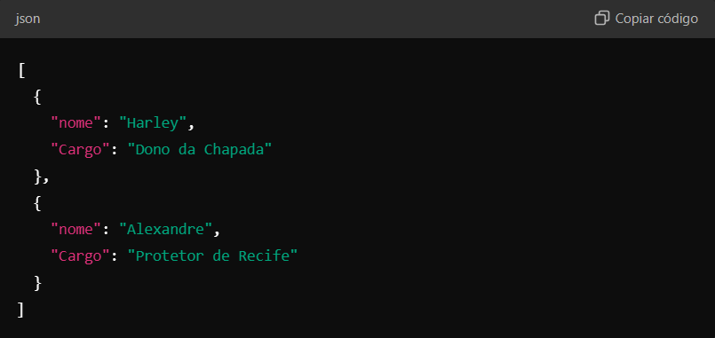
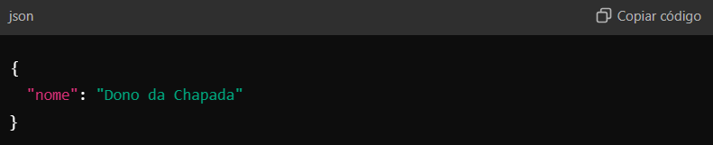
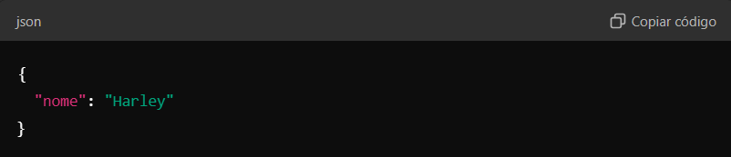
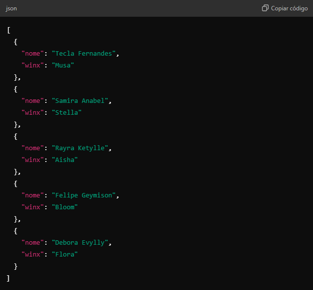
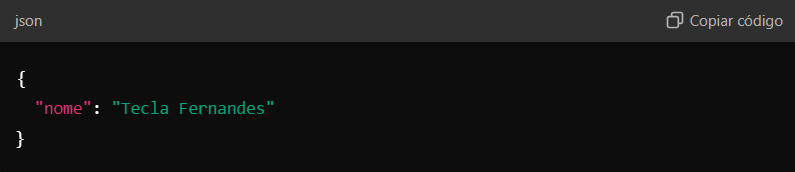

# API de Informações de Professores e Alunos

Esta é uma API básica desenvolvida em Node.js com Express. Ela fornece informações sobre professores e alunos, acessíveis por meio de diferentes endpoints.

## Pré-requisitos

- [Node.js](https://nodejs.org/) (versão 14 ou superior)

## Instalação

1. Clone o repositório:

   ```bash
   git clone https://github.com/seu-usuario/seu-repositorio.git

2. Instale as dependências:

   ```bash
   npm install express

3. Inicie o servidor:

   ```bash
   node app.js

O servidor estará disponível em http://localhost:3000.

## Endpoints

### **Professores**

**1. Listar todos os professores**

- Endpoint: /profgeral
- Método: GET
- Resposta:

   

**2. Obter cargo de um professor por ID**

- Endpoint: /prof/cargos/:id
- Método: GET
- Parâmetro: id - índice do cargo (0 para "Harley", 1 para "Alexandre")
- Exemplo de Resposta:


   

**3. Obter nome de um professor por ID**

- Endpoint: /prof/:id
- Método: GET
- Parâmetro: id - índice do professor (0 para "Harley", 1 para "Alexandre")
- Exemplo de Resposta:


   

### **Alunos**

**1. Listar todos os alunos**

- Endpoint: /alunosgeral
- Método: GET
- Resposta:

    

**2. Obter nome de um aluno por ID**

- Endpoint: /alunos/:id
- Método: GET
- Parâmetro: id - índice do aluno (0 para "Tecla Fernandes", etc.)
- Exemplo de Resposta:


   

## Tecnologias Utilizadas

- [Node.js](https://nodejs.org/pt)
- [Express](https://expressjs.com/)

## Licença

Este projeto está sob a licença MIT. Veja o arquivo LICENSE para mais detalhes.

   ```bash
   Esse README.md fornece uma visão geral da API, incluindo os endpoints e respostas esperadas, bem como instruções de instalação e execução.
